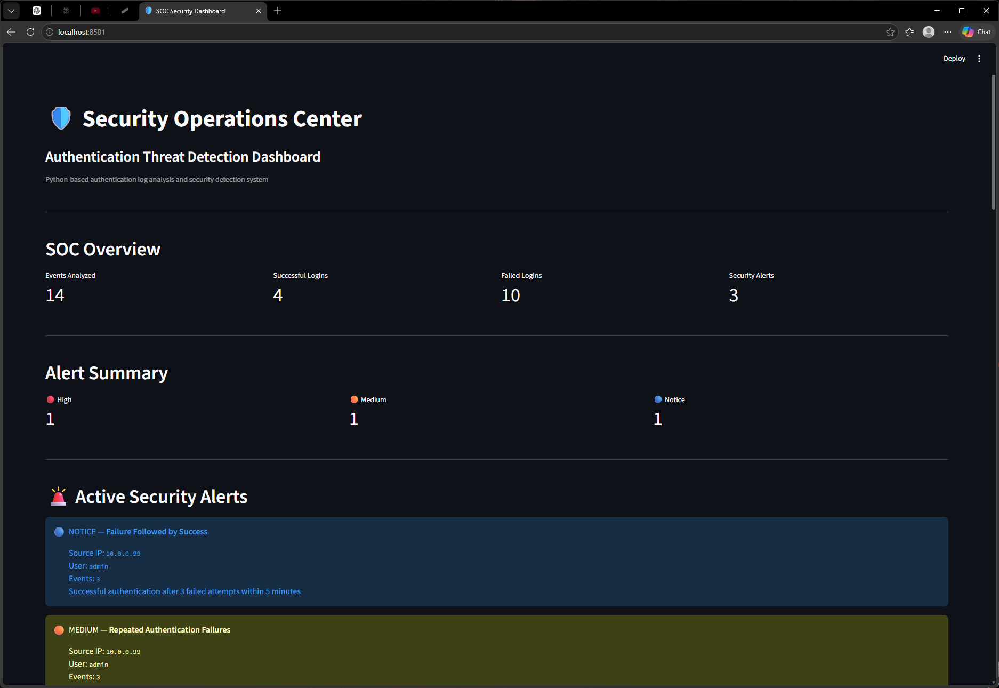

# Security Log Analyzer

A Python-based authentication log analysis and threat detection project with an interactive Security Operations Center (SOC) dashboard.

This project parses authentication events, applies detection rules, generates security alerts, exports structured reports, and presents the results through a Streamlit dashboard.

## SOC Dashboard



The dashboard provides a visual overview of authentication activity and security detections, including event counts, alert severity, failed authentication activity, targeted accounts, and source-IP investigation.

## Features

- Parses authentication log files
- Identifies successful and failed login attempts
- Tracks authentication activity by source IP
- Identifies targeted user accounts
- Uses time-window based detection
- Detects possible brute-force authentication activity
- Detects repeated authentication failures
- Detects failed-login attempts followed by successful authentication
- Separates raw security events from generated alerts
- Exports event and alert data to CSV
- Provides an interactive SOC-style dashboard
- Allows investigation of individual source IP addresses

### V7 — Continuous Security Monitoring

Version 7 introduces continuous log collection and live dashboard monitoring.

Features include:

- Continuous authentication log monitoring
- Automatic processing of newly generated log events
- Persistent event storage using SQLite
- Real-time security detection
- Duplicate alert protection
- HIGH brute-force detection
- MEDIUM repeated authentication failure detection
- NOTICE detection for successful authentication following failures
- Historical Year / Month / Day filtering
- Live SOC dashboard
- Configurable dashboard refresh
- Manual dashboard refresh
- Separate collection, detection, storage, and visualization components

## V7 Architecture

```text
Authentication Log
        |
        v
   collector.py
        |
        +---- Parse Events
        |
        +---- Detection Engine
        |
        v
   security.db
     /      \
    /        \
 Events      Alerts
    \          /
     \        /
      v      v
    dashboard.py
         |
         v
   SOC Dashboard

## Detection Rules

### Possible Brute Force — HIGH

Generates a HIGH severity alert when five or more failed authentication attempts from the same source IP occur within five minutes.

### Repeated Authentication Failures — MEDIUM

Generates a MEDIUM severity alert when three or more failed authentication attempts from the same source IP occur within five minutes.

### Failure Followed by Success — NOTICE

Generates a NOTICE when a successful authentication occurs from a source IP that generated failed authentication attempts during the previous five minutes.

These rules are intended for educational purposes and demonstrate basic security detection concepts. An alert indicates activity that may warrant investigation; it does not by itself establish malicious activity.

## Project Architecture

```text
sample_auth.log
       |
       v
   analyzer.py
       |
       +----------------------+
       |                      |
       v                      v
security_report.csv       alerts.csv
       |                      |
       +----------+-----------+
                  |
                  v
             dashboard.py
                  |
                  v
          Streamlit SOC Dashboard
```

## Technologies

- Python
- Streamlit
- pandas
- CSV
- Python datetime
- Python collections

## Installation

Clone the repository:

```bash
git clone YOUR_REPOSITORY_URL
cd security-log-analyzer
```

Install the required packages:

```bash
python -m pip install -r requirements.txt
```

## Running the Analyzer

Run:

```bash
python analyzer.py
```

The analyzer reads:

```text
sample_auth.log
```

and generates:

```text
security_report.csv
alerts.csv
```

## Running the Dashboard

After running the analyzer:

```bash
python -m streamlit run dashboard.py
```

Then open the local address provided by Streamlit in your web browser.

## Example Detection

Example authentication activity:

```text
LOGIN_FAILED
LOGIN_FAILED
LOGIN_FAILED
LOGIN_FAILED
LOGIN_FAILED
```

Five failed authentication attempts from the same source IP within the configured time window can generate:

```text
HIGH
Possible Brute Force
5 failed authentication attempts within 27 seconds
```

## Security Concepts Demonstrated

This project demonstrates introductory concepts related to:

- Security log analysis
- Authentication monitoring
- Security event correlation
- Detection engineering
- Time-window detection
- Alert severity classification
- SOC investigation workflows
- Security data visualization

## What I Learned

Building this project provided hands-on experience with:

- Parsing and analyzing authentication log data with Python
- Using dictionaries, lists, functions, and Python collections
- Working with timestamps and time-window detection
- Separating raw security events from generated security alerts
- Developing basic detection logic for authentication activity
- Correlating multiple events to identify suspicious patterns
- Exporting structured security data to CSV
- Using pandas for security data analysis
- Building an interactive dashboard with Streamlit
- Using Git and GitHub for source control and project documentation

This project also helped demonstrate the difference between an individual security event and a detection generated from multiple correlated events.

## Disclaimer

This project is an educational cybersecurity tool and is not intended to replace a production SIEM, intrusion detection system, or professional security monitoring platform.